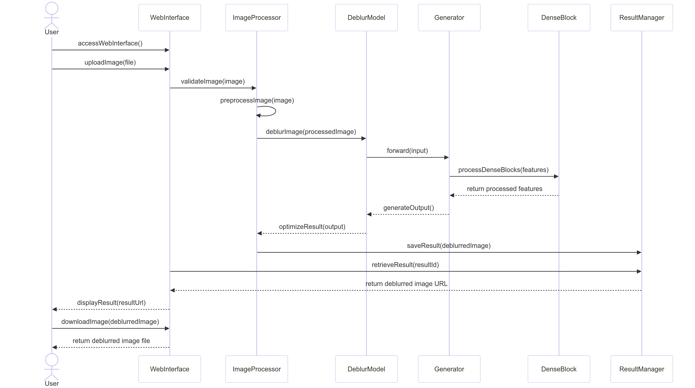

# Sequence Diagram Overview

## Scenario Description
The sequence diagram illustrates the interaction between a user and the Image Deblurring System when a user uploads a blurred image and receives the deblurred result. This covers the primary use case of the system.

### Informational Item

| Information | Description |
|-------------|-------------|
| Use Case    | Image Deblurring |
| Scenario Name | User Image Processing Flow |
| Steps | 1. User accesses the web interface 2. User uploads a blurred image 3. System validates the image format and size 4. System preprocesses the image for the neural network 5. Generator model processes the image through the dense field architecture 6. System optimizes the output image 7. System returns the deblurred image to the user 8. User downloads the deblurred image |

## Analysis Classes Description

| Class Name | Purpose |
|------------|---------|
| WebInterface | Front-end component that handles user interactions and file uploads |
| ImageProcessor | Service that validates, formats, and prepares images for processing |
| DeblurModel | Core ML component containing the Generator architecture for deblurring |
| Generator | PyTorch neural network with dense connections that performs the actual deblurring |
| DenseBlock | Building block of the Generator that processes features at different scales |
| ResultManager | Component that handles storage and delivery of processed images |

# Message Description

| Message | Type | From Object | To Object |
|---------|------|------------|-----------|
| accessWebInterface() | Synchronous | User | WebInterface |
| uploadImage(file) | Synchronous | User | WebInterface |
| validateImage(image) | Synchronous | WebInterface | ImageProcessor |
| preprocessImage(image) | Synchronous | ImageProcessor | ImageProcessor |
| deblurImage(processedImage) | Synchronous | ImageProcessor | DeblurModel |
| forward(input) | Synchronous | DeblurModel | Generator |
| processDenseBlocks(features) | Synchronous | Generator | DenseBlock |
| generateOutput() | Synchronous | Generator | DeblurModel |
| optimizeResult(output) | Synchronous | DeblurModel | ImageProcessor |
| saveResult(deblurredImage) | Synchronous | ImageProcessor | ResultManager |
| retrieveResult(resultId) | Synchronous | WebInterface | ResultManager |
| displayResult(resultUrl) | Synchronous | WebInterface | User |
| downloadImage(deblurredImage) | Synchronous | User | WebInterface |

