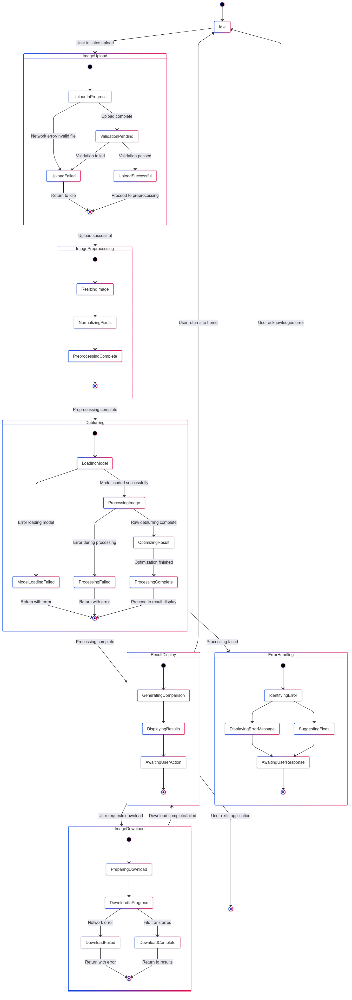

# State Chart Diagram Overview

## Object State Description

| Object Name | States |
|-------------|--------|
| Image Deblurring System | Idle, ImageUpload, ImagePreprocessing, Deblurring, ResultDisplay, ErrorHandling, ImageDownload |

## States Description

| State Name | Type | Action Set |
|------------|------|------------|
| Idle | Simple | System waits for user to initiate image upload |
| ImageUpload | Composite | Handles file selection, upload process, and validation |
| ImagePreprocessing | Composite | Prepares image for deblurring (resizing, normalization) |
| Deblurring | Composite | Executes deblurring algorithm, manages processing states |
| ResultDisplay | Composite | Shows comparison and final results to user |
| ErrorHandling | Composite | Manages error states and user feedback |
| ImageDownload | Composite | Handles file preparation and download process |

### ImageUpload State Details
- **UploadInProgress**: System is receiving the image file
- **ValidationPending**: System is verifying file format, size, and content
- **UploadSuccessful**: File has been accepted and is ready for processing
- **UploadFailed**: File upload or validation has failed

### ImagePreprocessing State Details
- **ResizingImage**: System is adjusting image dimensions for model input
- **NormalizingPixels**: System is standardizing pixel values
- **PreprocessingComplete**: Image is prepared for the deblurring model

### Deblurring State Details
- **LoadingModel**: System is initializing the deblurring neural network
- **ModelLoadingFailed**: Error occurred during model initialization
- **ProcessingImage**: Model is actively deblurring the image
- **ProcessingFailed**: Error occurred during deblurring
- **OptimizingResult**: System is enhancing the deblurred output
- **ProcessingComplete**: Deblurring process has completed successfully

### ResultDisplay State Details
- **GeneratingComparison**: Creating side-by-side view of original and deblurred images
- **DisplayingResults**: Showing the comparison to the user
- **AwaitingUserAction**: Waiting for user's next action (download, restart, exit)

### ErrorHandling State Details
- **IdentifyingError**: System is determining the error type
- **DisplayingErrorMessage**: Showing appropriate error message to user
- **SuggestingFixes**: Offering possible solutions based on error type
- **AwaitingUserResponse**: Waiting for user to acknowledge or act on error

### ImageDownload State Details
- **PreparingDownload**: System is preparing file for download
- **DownloadInProgress**: File is being transferred to user's device
- **DownloadFailed**: Error occurred during file transfer
- **DownloadComplete**: File has been successfully transferred

## Specific Description

### Transitions

| Transition | Event | Guard Condition | Transition Action |
|------------|-------|----------------|-------------------|
| Idle → ImageUpload | User initiates upload | - | Display upload interface |
| ImageUpload → ImagePreprocessing | Upload successful | Validation passed | Begin preprocessing |
| ImageUpload → Idle | Upload cancelled | - | Clear upload data |
| ImagePreprocessing → Deblurring | Preprocessing complete | - | Initialize deblurring model |
| Deblurring → ResultDisplay | Processing complete | - | Generate results view |
| Deblurring → ErrorHandling | Error detected | Processing error | Identify error type |
| ResultDisplay → ImageDownload | User requests download | - | Prepare download file |
| ResultDisplay → Idle | User returns to home | - | Clear current results |
| ErrorHandling → Idle | User acknowledges error | - | Clear error state |
| ImageDownload → ResultDisplay | Download complete/failed | - | Return to results view |
| ResultDisplay → [Exit] | User exits application | - | Clean up resources |

The state chart diagram illustrates the complete lifecycle of an image through the deblurring system, from initial upload through processing to the final display and download of results. Each composite state encapsulates related sub-states that handle specific aspects of the system's functionality.

The system begins in the Idle state and transitions through various states based on user actions and processing outcomes. Error states are handled gracefully with appropriate feedback mechanisms, allowing users to understand issues and take corrective action when possible.

This state-based approach helps ensure the system maintains consistency and provides appropriate user feedback regardless of the processing path or potential issues encountered during the deblurring process.

